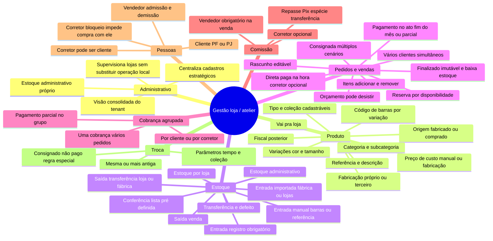
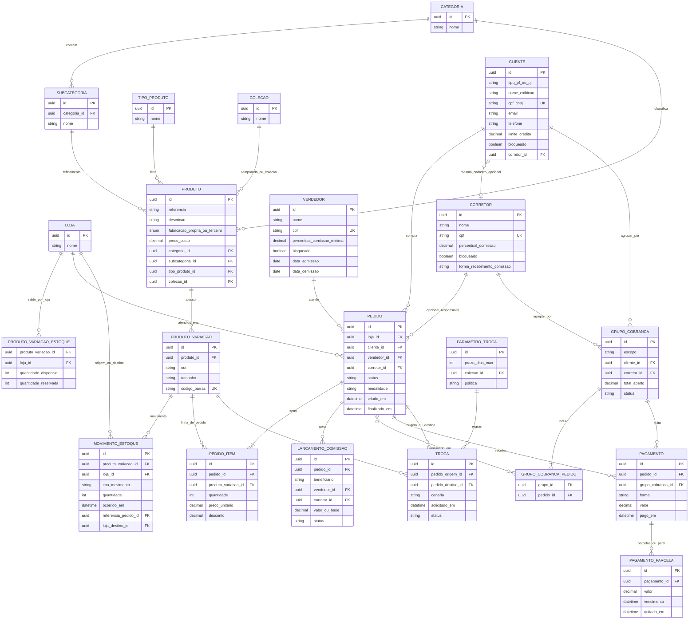

# Mapa mental e modelo de dados (ER)

Documento derivado de [especificacao-excalidraw-produto-vendas-cadastros.md](./especificacao-excalidraw-produto-vendas-cadastros.md).

Use a pré-visualização Markdown para ver os diagramas Mermaid.

---

## 1. Mapa mental

---

## 2. Relacionamento de banco (visão ER)

**Premissas de modelagem:** uma entidade `loja` cobre “esta loja” e transferências, incluindo a loja/contexto administrativo quando ele existir no tenant; `cliente` unifica PF/PJ com campos opcionais conforme tipo; `corretor` e `cliente` podem ser ligados se a mesma pessoa exercer os dois papéis.

---

## 3. Notas rápidas de implementação

- `**PRODUTO_VARIACAO_ESTOQUE`:** pode ser derivado só de `MOVIMENTO_ESTOQUE` (materialized view ou saldo atualizado em transação). A especificação fala em **baixa só ao finalizar** o pedido: considere `quantidade_reservada` enquanto o pedido está em rascunho.
- `**CLIENTE.corretor_id`:** modela “corretor também é cliente” com um único vínculo opcional; alternativa é tabela `PESSOA` com papéis (`cliente`, `corretor`, `vendedor`) se quiser normalizar CPF uma vez só.
- `**PAGAMENTO`:** o quadro mistura “pagamento do pedido” e “quitação de grupo”; na prática pode ser uma entidade com `pedido_id` **ou** `grupo_cobranca_id` (restrição: exatamente um dos dois preenchidos, conforme regra de negócio).
- **Fiscal:** quando definirem NF-e / consignação, surgem tabelas como `nota_fiscal`, `item_nota`, vínculos com `MOVIMENTO_ESTOQUE` e `PEDIDO`.

Se quiser, no próximo passo dá para reduzir o ER a **primeira versão MVP** (menos tabelas) ou exportar para SQL (`CREATE TABLE`) no dialeto que você for usar.
