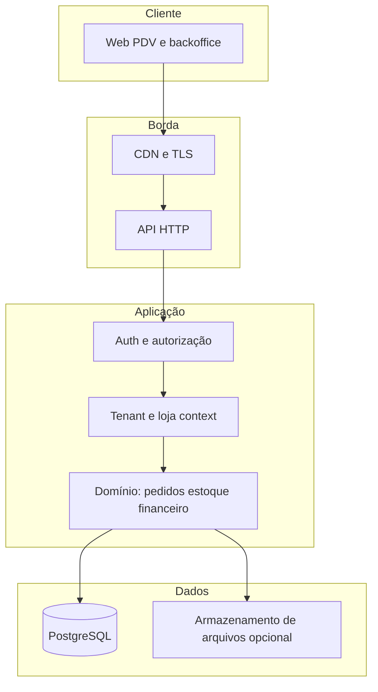

# AtelierHub — Regras de negócio, páginas e arquitetura

Documento de referência para o produto: **PDV + gestão financeira**, **multi-empresa (multi-tenant)** e **multi-loja** por empresa.  
Baseado em [especificacao-excalidraw-produto-vendas-cadastros.md](./especificacao-excalidraw-produto-vendas-cadastros.md), [mapa-mental-e-modelo-dados.md](./mapa-mental-e-modelo-dados.md), no quadro Excalidraw alinhado a este doc (ex.: `https://excalidraw.com/#json=DRqzTM02jKhjgDVAsCqIu,KsevcDKpAckwSfCAe9K_CQ`) e nas evoluções discutidas (multi-tenant, status de pedido, comissões por meta).

---

## Sumário

1. [Visão do produto](#1-visão-do-produto)
2. [Glossário](#2-glossário)
3. [Princípios multi-tenant e multi-loja](#3-princípios-multi-tenant-e-multi-loja)
4. [Regras de negócio](#4-regras-de-negócio)
5. [Estados do pedido e estoque](#5-estados-do-pedido-e-estoque)
6. [Comissões](#6-comissões)
7. [Mapa de páginas (o que cada tela deve ter)](#7-mapa-de-páginas-o-que-cada-tela-deve-ter)
8. [Arquitetura do projeto](#8-arquitetura-do-projeto)
9. [Melhorias e próximos passos sugeridos](#9-melhorias-e-próximos-passos-sugeridos)
10. [Backlog técnico do MVP](./backlog-tecnico-mvp.md)

---

## 1. Visão do produto

- **O quê:** sistema operacional para lojas de moda/atelier: cadastros, catálogo com variações, estoque por loja, **tela de vendas da loja** (lista e histórico com filtros), **PDV rápido** (cliente, vendedor, corretor, produtos, pagamentos — em geral em **modal ~80%** a partir de “Nova venda”), **pagamentos** (incluindo parcial e agrupado), **comissões** de vendedor e corretor, **trocas** com regras.
- **Para quem:** várias **empresas** (tenants) independentes; em cada empresa, uma ou **várias lojas**.
- **Usuários típicos:** vendedora (PDV e pedidos), gestor financeiro, gestor de estoque/cadastros, administrador da empresa (configurações), e opcionalmente **super-admin** da plataforma (criação de tenants).

---

## 2. Glossário

| Termo                      | Significado                                                                                                                     |
| -------------------------- | ------------------------------------------------------------------------------------------------------------------------------- |
| **Tenant**                 | Empresa contratante do sistema; isolamento total de dados entre tenants.                                                        |
| **Loja**                   | Unidade (filial/ponto de venda) **dentro** de um tenant.                                                                        |
| **Pedido**                 | Documento de venda/orçamento com itens; passa por estados até quitação.                                                         |
| **Venda direta**           | Cliente retira e paga conforme acordado (inclui “na hora”); corretor opcional.                                                  |
| **Venda consignada**       | Retiradas ao longo do tempo; pagamento pode ser no fim do período; cenários com corretor responsável.                           |
| **Corretor**               | Intermediário opcional; comissão própria; se bloqueado, **não** pode ser usado em novas vendas.                                 |
| **Grupo de cobrança**      | Agrupamento de pedidos em aberto para quitar **uma vez** (por cliente ou por corretor), com possibilidade de pagamento parcial. |
| **Variação (SKU)**         | Combinação cor/tamanho (etc.) do produto, com código de barras próprio quando aplicável.                                        |
| **PDV**                    | Superfície **focada** para montar e quitar uma venda: cliente, vendedor, corretor, produtos e pagamentos (venda rápida).        |
| **Tela de vendas da loja** | Tela **geral** de vendas: lista, histórico e filtros temporais — não substitui o PDV rápido.                                    |

---

## 3. Princípios multi-tenant e multi-loja

### 3.1 Regras

- **RN-T1:** Todo registro de negócio pertence a exatamente um `tenant_id`.
- **RN-T2:** Operações de leitura/escrita devem **sempre** filtrar por `tenant_id` derivado da **sessão** (nunca confiar só no cliente).
- **RN-L1:** Estoque, pedidos e movimentos são, em regra, por **loja_id** (salvo processos explícitos de transferência entre lojas).
- **RN-L2:** Cadastros como cliente, corretor, produto podem ser **do tenant** com uso em várias lojas; a especificação original não exige “cliente só de uma loja” — definir se **cliente é compartilhado entre lojas do tenant** (recomendado: sim, com histórico por loja) ou isolado por loja.
- **RN-L3:** Deve existir uma **loja administrativa** (ou contexto administrativo equivalente) dentro do mesmo tenant, responsável por **centralizar a visão do negócio** e manter um **estoque administrativo** próprio.
- **RN-L4:** Cada loja operacional se **autogerencia** no dia a dia: enxerga suas próprias vendas, metas, pedidos, equipe e estoque.
- **RN-L5:** O administrativo enxerga o **conjunto** das lojas: consolidação de estoque, vendas, metas e operação geral, sem depender de trocar manualmente a visão para cada unidade.
- **RN-L6:** Lojas operacionais **não** devem ter visão gerencial cruzada entre si (ex.: faturamento, metas, desempenho de vendedores ou comparativos entre lojas), salvo permissão explícita de perfil administrativo.
- **RN-U1:** Usuário pode ter acesso a **uma ou mais lojas**; PDV opera sempre em **uma loja selecionada** (contexto da sessão).
- **RN-U2:** Na tela de **login** **não** há seleção de **tenant**. O tenant vem do **cadastro do usuário** (convite/vínculo) e, se aplicável, do **subdomínio** ou URL da empresa. Troca de empresa (quando o usuário tiver mais de um tenant) ocorre **dentro do sistema autenticado** (ex.: menu “Trocar empresa” / seletor no cabeçalho), não no login.
- **RN-U3:** Após login bem-sucedido: se o usuário tem **apenas uma loja** liberada → ir **direto ao dashboard** com essa loja já definida na sessão. Se tem **mais de uma loja** → exibir **seleção de loja** antes de entrar no fluxo principal (ou no primeiro acesso da sessão); depois, dashboard. O usuário pode **trocar de loja** a qualquer momento pelo cabeçalho (sem novo login).

### 3.2 Implicação de produto

- Login → apenas **credenciais**; o backend associa **tenant** e **perfil** ao token/sessão conforme vínculos do usuário.
- **Seleção de tenant** (caso raro, ex.: suporte ou usuário multi-empresa): **dentro** da aplicação após autenticado.
- Opcional: **subdomínio** por tenant (`empresa.app.com`) para reforço de contexto e UX (o login continua sem lista de empresas).

---

## 4. Regras de negócio

### 4.1 Produto e catálogo

- **RN-P1:** Produto tem **referência** (código escolhido pela empresa), **descrição**, **tipo de fabricação** (próprio/terceiro), **preço de custo** (manual ou importado de fabricação — módulo futuro).
- **RN-P2:** **Variações** incluem pelo menos cor e tamanho; **código de barras** é por variação (gerado ou informado).
- **RN-P3:** **Tipo** (ex.: masculino, infantil…) e **coleção** são cadastros auxiliares definidos pelo tenant.
- **RN-P4:** **Categoria** e **subcategoria** hierárquicas para filtros.
- **RN-P5:** Parte **fiscal** segue em **detalhamento progressivo**; até a fase fiscal fechada, campos podem existir como opcionais/placeholder.
- **RN-P6:** **Informações fiscais por produto** — dados tributários e fiscais vinculados ao cadastro do produto (ex.: NCM, CEAN, origem, regras de CFOP/CST conforme definido com contador). Escopo exato e obrigatoriedade por operação ficam no módulo fiscal.

### 4.2 Estoque

- **RN-E1:** Toda entrada de mercadoria na loja gera **registro de entrada** (rastreável).
- **RN-E2:** Entrada **manual** por código de barras ou referência.
- **RN-E3:** Entrada **importada** (fábrica ou outra loja do mesmo tenant) com fluxo de **conferência** (lista esperada × confirmada).
- **RN-E4:** Saídas válidas: **venda** (via pedido finalizado), **transferência** (outra loja/fábrica), **defeito** (retorno fábrica conforme processo).
- **RN-E5:** Transferências entre lojas devem manter **rastro** (origem, destino, documento de movimento).
- **RN-E6:** Deve existir **rotina de balanço de estoque** (inventário físico) por **loja**, confrontando quantidade **contada** com saldo do sistema.
- **RN-E7:** O balanço deve gerar **relatório de divergências** (acréscimos, faltas, possível valorização) e subsidir **ajustes** rastreados (quem, quando, motivo), após política de aprovação se o tenant exigir.
- **RN-E8:** O **administrativo** também possui **estoque próprio**, distinto do estoque de cada loja operacional, e pode atuar como origem central de distribuição e transferência.
- **RN-E9:** O administrativo deve ter visão de **todos os estoques** do tenant; cada loja, por padrão, deve enxergar **seu próprio estoque** e somente a parcela de visão externa liberada pela política do negócio.
- **RN-E10:** Quando houver consulta cruzada entre lojas, a visibilidade padrão deve priorizar **disponibilidade de estoque** e não indicadores gerenciais da outra unidade.

### 4.3 Pedido e papéis

- **RN-V1:** Pedido **obrigatório:** cliente + vendedor; **corretor** é opcional.
- **RN-V2:** Modalidade de venda: **direta** ou **consignada** (comportamento de pagamento e prazo diferenciados na prática).
- **RN-V3:** Pedido em elaboração permite **adicionar/remover itens**; após **finalização**, **não** altera itens nem preços acordados (correções via processo de estorno/cancelamento — ver melhorias).
- **RN-V4:** Vários pedidos podem coexistir (vários clientes atendidos pela mesma vendedora).
- **RN-V5:** Pedido **em andamento** pode ser **excluído** (especificado no quadro); efeito: libera qualquer reserva associada, sem movimento financeiro.
- **RN-C1:** Se **corretor** estiver **bloqueado**, **não** aparece para selecioná-lo em **novo** pedido.
- **RN-C2:** **Corretor** pode ser também **cliente** (vínculo explícito no cadastro ou pessoa com dois papéis).

### 4.3.1 Tela de vendas da loja vs PDV rápido (navegação e superfícies)

- **RN-V6:** O **PDV rápido** é a superfície **enxuta e focada** na operação de venda: **cliente** (obrig.), **vendedor**, **corretor** (opc.), **modalidade** (direta / consignada), **inclusão de produtos** (busca, barras, carrinho), **pagamentos** e ações **salvar em andamento** / **finalizar** (com efeitos já definidos em §5). O PDV rápido **não** deve carregar o papel de “painel histórico” da loja.
- **RN-V7:** A **tela de vendas da loja** é a visão **geral**: **lista** de pedidos/vendas, **histórico** e leitura do que já foi vendido ou está em aberto. Inclui **filtros por data** (intervalo customizado) e **atalhos de período** (ex.: hoje, ontem, esta semana, este mês, últimos 7/30 dias). Essa tela **não** é um segundo formulário de venda em tela cheia equivalente ao PDV rápido.
- **RN-V8:** O atalho **Nova venda** (na tela de vendas da loja e, se desejado, em outros pontos autorizados) abre o **mesmo fluxo de PDV rápido** dentro de um **modal** que ocupa aproximadamente **80%** da área útil da viewport (em **mobile**, pode evoluir para **tela cheia** ou drawer, mantendo o mesmo conteúdo). Ao **fechar** o modal, o usuário permanece na **tela de vendas da loja** com lista/filtros atualizados.
- **RN-V9:** O PDV rápido pode ser alcançado também por **atalhos globais** (ex.: sidebar “PDV” / “Nova venda”, botão no **dashboard**): reutilizar o **mesmo componente** do PDV; a apresentação pode ser **modal (80%)** ou **rota dedicada** `/pdv`, desde que a experiência focada seja a mesma (decisão de produto/UX por breakpoint).
- **RN-V10:** Os **dois tipos de venda** do negócio (**direta** e **consignada**) continuam selecionáveis **no PDV rápido** (RN-V2); a tela de vendas da loja lista ambos indistintamente, com filtros que podem incluir modalidade/estado quando útil.

### 4.4 Pagamentos

- **RN-F1:** Pagamento pode ser **no ato**, **pendente** (ex.: fim do mês) ou **parcial** com múltiplos recebimentos ao longo do tempo.
- **RN-F2:** Deve existir fluxo de **agrupar pedidos em aberto** em uma **cobrança** única, tanto por **cliente** quanto por **corretor**.
- **RN-F3:** Cobrança agrupada também admite **pagamento parcial** (saldo remanescente até quitar).
- **RN-F4:** **Limite de crédito** (quando cadastrado) deve ser **consultado** antes de finalizar pedido ou liberar retirada — política exata (bloqueio total vs alerta) a fechar com o negócio.

### 4.5 Cliente (PF/PJ)

- **RN-CL1:** PF: nome, CPF, endereço, telefone, e-mail, aniversário; limite de crédito opcional; status bloqueado/ativo.
- **RN-CL2:** PJ: fantasia, razão social, CNPJ, IE com flag **isento**, endereço, telefone, e-mail, responsável + telefone; limite opcional; bloqueado/ativo.
- **RN-CL3:** Alteração de **bloqueado/ativo** deve exigir **confirmação reforçada** (ex.: senha de gestor ou 2FA) — conforme especificação.

### 4.6 Corretor

- **RN-CR1:** Dados cadastrais completos + **% comissão** + forma de recebimento (Pix/espécie/transferência) + dados bancários/Pix.
- **RN-CR2:** Limite de crédito opcional (contexto boleto/cheque).

### 4.7 Vendedor

- **RN-VD1:** Cadastro PF com admissão/demissão; **demissionado** some da lista de seleção no PDV.
- **RN-VD2:** **% comissão mínima** cadastral; **metas** podem alterar o percentual efetivo (ver §6).

### 4.7.1 Centralização administrativa

- **RN-ADM1:** O **administrativo** é o contexto central do tenant para acompanhamento global das lojas, sem descaracterizar a autonomia operacional de cada unidade.
- **RN-ADM2:** Cadastros estratégicos, como **produto**, **corretor** e **vendedor**, podem ser centralizados no administrativo e disponibilizados às lojas conforme política de permissão.
- **RN-ADM3:** O administrativo pode operar **sem rotina de PDV** própria, concentrando-se em estoque, cadastros, conferências, transferências e visão consolidada.
- **RN-ADM4:** Cada loja deve continuar com gestão própria de vendas, metas e operação local, enquanto o administrativo atua como camada de supervisão e coordenação.

### 4.8 Troca

- **RN-TRO1:** Parâmetros configuráveis: prazo, coleção, política “mesma peça” vs “mais antiga”, etc.
- **RN-TRO2:** Fluxo específico para itens em **consignado ainda não pagos** (não reutilizar troca “padrão” sem validação).

### 4.9 Fiscal (futuro)

- **RN-NF1:** Quando existir módulo fiscal: amarrar NF-e/devolução/consignação fiscal aos movimentos de estoque e pedidos; reutilizar **informações fiscais por produto** (RN-P6) como base de cálculo e emissão — **a detalhar** com contador e legislação.

---

## 5. Estados do pedido e estoque

Alinhado ao quadro atualizado do Excalidraw + sugestões de fechamento.

| Estado                                  | Estoque                                                                             | Financeiro                                          | Edição / exclusão                                                    |
| --------------------------------------- | ----------------------------------------------------------------------------------- | --------------------------------------------------- | -------------------------------------------------------------------- |
| **Em andamento**                        | **Não** baixa definitiva; **valida disponibilidade** (reserva opcional — ver §9)    | Não gera contas a receber definitivas até finalizar | **Editável**; **pode excluir**                                       |
| **Em aberto** (finalizado, não quitado) | **Baixa** no estoque                                                                | Gera valor a receber / parcelas conforme acordo     | **Não** editar itens; ajustes via estorno/cancelamento (recomendado) |
| **Pago parcial**                        | Mantém baixa                                                                        | Saldo em aberto                                     | Mesmas restrições de “Em aberto”                                     |
| **Quitado**                             | Mantém baixa                                                                        | Zerado para o pedido                                | Encerrado                                                            |
| **Cancelado** *(sugerido)*              | **Estorna** baixa se já tinha sido dado; cancela contas pendentes conforme política | Estorno/devolução registrados                       | Auditoria obrigatória                                                |

**Regra sugerida de consistência:** só transicionar para **Em aberto** se **todos** os itens tiverem quantidade disponível (ou permitir finalização parcial — decisão de produto; se não, bloquear com mensagem clara).

---

## 6. Comissões

Conforme **quadro atualizado** (metas + corretor); valores são **exemplo da operação modelo** — parametrizar por tenant.

### 6.1 Vendedor

- **RN-CM1:** Toda venda gera comissão para o **vendedor** do pedido.
- **RN-CM2:** Percentual efetivo depende da **meta** do período (exemplo documentado):
  - abaixo da meta: **1,5%**
  - primeira meta: **1,8%**
  - segunda meta: **2%**
  - terceira meta: **2,5%**
- **RN-CM3:** **Adicional de 0,5%** sobre a base de todas as metas quando a venda é **sem corretor**.
- **RN-CM4:** **Adicional de 1,5%** para venda **varejo** (definir critério técnico: flag no pedido, tipo de cliente, canal, etc.).
- **RN-CM5:** Comissão do vendedor e do corretor são **independentes** (bases e percentuais distintos), salvo regra futura explícita.

### 6.2 Corretor

- **RN-CM6:** Pedido **com** corretor gera comissão para o corretor.
- **RN-CM7:** Padrão **10%** no cadastro do corretor; alterável **por corretor**.

### 6.3 Lançamentos

- **RN-CM8:** Sistema deve gerar **lançamentos** de comissão (a pagar / pago) para conciliação e pagamento externo (Pix/transferência).

---

## 7. Mapa de páginas (o que cada tela deve ter)

Organização por **módulos**. Ajuste nomes ao framework escolhido (rotas/menus).

### 7.1 Autenticação e contexto

| Página                                             | Conteúdo / ações                                                                                                                                              |
| -------------------------------------------------- | ------------------------------------------------------------------------------------------------------------------------------------------------------------- |
| **Login**                                          | E-mail/usuário, senha, “esqueci senha”. **Sem** escolha de tenant na mesma tela — tenant inferido do vínculo do usuário (e opcionalmente do host/subdomínio). |
| **Seleção de loja**                                | Exibida **só** se o usuário tiver **mais de uma** loja permitida (RN-U3). Caso contrário, o fluxo **pula** esta tela e segue para o **dashboard**.            |
| **Troca de empresa (tenant)** *(quando aplicável)* | Dentro do app autenticado: seletor ou tela de contexto para usuários com acesso a **vários tenants** (não no login).                                          |
| **Recuperação de senha**                           | Fluxo por e-mail/token.                                                                                                                                       |

### 7.2 Início / dashboard

| Página        | Conteúdo / ações                                                                                                                                                                                                                                                                                                                                                                                                                                                                                                                   |
| ------------- | ---------------------------------------------------------------------------------------------------------------------------------------------------------------------------------------------------------------------------------------------------------------------------------------------------------------------------------------------------------------------------------------------------------------------------------------------------------------------------------------------------------------------------------- |
| **Dashboard** | Resumo do dia: vendas (finalizadas), pedidos em andamento, valor em aberto, alertas de estoque baixo, metas (se aplicável). **Atalhos operacionais:** abrir **PDV rápido** (modal ~80% ou rota dedicada — RN-V8/V9), link para **Tela de vendas da loja** (lista/histórico), **Consulta produto** (ou busca rápida). **Atalhos para cadastros** (conforme permissão): **Clientes**, **Corretores**, **Vendedores**, **Produtos**, **Categorias / tipos / coleções** (podem ser um único bloco “Cadastros” com sublinks ou botões). |

### 7.2.1 Área administrativa

| Página                              | Conteúdo / ações                                                                                                                                                         |
| ----------------------------------- | ------------------------------------------------------------------------------------------------------------------------------------------------------------------------ |
| **Painel administrativo**           | Visão consolidada do tenant: estoque total, desempenho agregado, alertas operacionais, pendências de conferência, transferências e atalhos para cadastros centrais.      |
| **Lojas**                           | CRUD de lojas; responsável da unidade; status ativa/inativa; dados básicos e parâmetros operacionais.                                                                    |
| **Vendedores**                      | CRUD centralizado de vendedores; vínculo com lojas quando aplicável; comissão mínima; situação ativa/demitido.                                                           |
| **Corretores**                      | CRUD centralizado de corretores; comissão padrão; bloqueio/ativo; dados de recebimento.                                                                                  |
| **Produtos e cadastros auxiliares** | Entrada central para CRUD de produtos, categorias, subcategorias, tipos e coleções, quando a operação do tenant optar por centralizar esses cadastros no administrativo. |
| **Usuários e permissões**           | Convites, papéis (vendedor, gestor, financeiro, admin), lojas permitidas e definição de quem acessa a área administrativa ou apenas a operação da loja.                  |

### 7.3 Cadastros — pessoas

Observação de contexto: quando o tenant adotar **centralização administrativa**, os CRUDs de **vendedores** e **corretores** são executados a partir da **área administrativa**; as telas abaixo descrevem o conteúdo funcional desses cadastros.

| Página                     | Conteúdo / ações                                                                                                    |
| -------------------------- | ------------------------------------------------------------------------------------------------------------------- |
| **Clientes (lista)**       | Busca por nome/CPF/CNPJ/telefone; filtros ativo/bloqueado; indicador PF/PJ.                                         |
| **Cliente — novo/editar**  | Formulário PF ou PJ conforme §4.5; ação “bloquear” com confirmação reforçada; vínculo opcional “também é corretor”. |
| **Corretores (lista)**     | Busca; status; % padrão visível.                                                                                    |
| **Corretor — novo/editar** | Dados completos + comissão + Pix/transferência; bloqueio com confirmação reforçada.                                 |
| **Vendedores (lista)**     | Ativos vs demitidos (filtro); admissão visível.                                                                     |
| **Vendedor — novo/editar** | Dados, comissão mínima, datas, bloqueio com confirmação.                                                            |

### 7.4 Cadastros — catálogo auxiliar

| Página                         | Conteúdo / ações                           |
| ------------------------------ | ------------------------------------------ |
| **Categorias / subcategorias** | Árvore ou lista hierárquica; CRUD.         |
| **Tipos de produto** (filtro)  | CRUD simples.                              |
| **Coleções**                   | CRUD; uso em produto e em regras de troca. |

### 7.5 Produtos

| Página                    | Conteúdo / ações                                                                                                                                                                                                                          |
| ------------------------- | ----------------------------------------------------------------------------------------------------------------------------------------------------------------------------------------------------------------------------------------- |
| **Produtos (lista)**      | Filtros: referência, categoria, tipo, coleção, fabricação; status ativo/inativo (sugerido).                                                                                                                                               |
| **Produto — novo/editar** | Dados principais + grid de **variações** (cor, tamanho, barras, custo se por variação); preview de estoque por loja (link); seção **Informações fiscais** (campos conforme RN-P6; podem ficar ocultos/desabilitados até o módulo fiscal). |
| **Detalhe produto**       | Ficha, variações, bloco fiscal (quando existir), histórico de movimentos (link para estoque).                                                                                                                                             |

### 7.6 Estoque

| Página                                  | Conteúdo / ações                                                                                                                                                                                              |
| --------------------------------------- | ------------------------------------------------------------------------------------------------------------------------------------------------------------------------------------------------------------- |
| **Estoque por loja**                    | Visão atual por SKU; filtros; exportação (sugerido).                                                                                                                                                          |
| **Entrada manual**                      | Leitura por **barras** ou busca por referência; quantidade; motivo/documento.                                                                                                                                 |
| **Entrada importada / conferência**     | Lista esperada × recebido; confirmação gera movimentos.                                                                                                                                                       |
| **Transferência**                       | Origem/destino (lojas do tenant); itens e quantidades; status enviado/recebido (sugerido).                                                                                                                    |
| **Saída por defeito**                   | Destino fábrica/fornecedor; vínculo opcional a NF futura.                                                                                                                                                     |
| **Balanço de estoque**                  | Por loja: iniciar período de contagem; lançar contagens por SKU (barras ou busca); comparar com saldo do sistema; status rascunho/concluído; opção de gerar **ajustes** após conferência (conforme RN-E6/E7). |
| **Relatório de divergências (balanço)** | Lista de SKUs com diferença (sistema × contado), quantidade e, se aplicável, valor; exportação (CSV/PDF); vínculo ao documento de balanço.                                                                    |
| **Histórico de movimentos**             | Auditoria por SKU/loja/período/usuário.                                                                                                                                                                       |

### 7.7 Tela de vendas da loja e PDV rápido

Duas superfícies complementares (RN-V6 a RN-V10): a **tela de vendas da loja** para **ver histórico e listar**; o **PDV rápido** para **executar** a venda. O PDV rápido é reutilizado no **modal ~80%** ao iniciar “Nova venda” a partir da tela principal.

#### 7.7.1 Tela de vendas da loja (lista e histórico)

| Página                                        | Conteúdo / ações                                                                                                                                                                                                                                                                                                                                                                                                                                                                                            |
| --------------------------------------------- | ----------------------------------------------------------------------------------------------------------------------------------------------------------------------------------------------------------------------------------------------------------------------------------------------------------------------------------------------------------------------------------------------------------------------------------------------------------------------------------------------------------- |
| **Tela de vendas da loja** *(tela principal)* | Visão **ampla**, estilo painel: **tabela ou lista** de pedidos/vendas com colunas essenciais (código, data, cliente, vendedor, valor, estado, modalidade…). **Filtro por intervalo de datas** + **presets rápidos** (hoje, ontem, semana atual, mês atual, últimos 7/30 dias, etc.). Filtros adicionais: estado, cliente, vendedor, corretor, loja. Deve permitir **busca rápida** por **número do pedido** e **nome do cliente**. **Atalho destacado “Nova venda”** → abre o **PDV rápido em modal ~80%**. |
| **Detalhe do pedido**                         | A partir da lista: itens, totais, histórico de pagamentos, comissões calculadas, timeline de status.                                                                                                                                                                                                                                                                                                                                                                                                        |
| **Recebimento (pedido)**                      | Registrar pagamento (forma, valor); **parcial**; atualiza estado (parcial/quitado). Pode ser acessado do detalhe ou fluxos financeiros.                                                                                                                                                                                                                                                                                                                                                                     |
| **Grupos de cobrança**                        | Criar grupo por **cliente** ou **corretor**; incluir pedidos “em aberto”; total; receber parcial/total.                                                                                                                                                                                                                                                                                                                                                                                                     |
| **Contas a receber**                          | Visão agregada por cliente/corretor/pedido; aging (sugerido). Link a partir da tela de vendas da loja ou menu financeiro.                                                                                                                                                                                                                                                                                                                                                                                   |

#### 7.7.2 PDV rápido (conteúdo do modal ou rota dedicada)

| Superfície                    | Conteúdo / ações                                                                                                                                                                                                                                                                                                                                                                                                           |
| ----------------------------- | -------------------------------------------------------------------------------------------------------------------------------------------------------------------------------------------------------------------------------------------------------------------------------------------------------------------------------------------------------------------------------------------------------------------------- |
| **PDV rápido** *(componente)* | **Somente** o fluxo operacional: **cliente** (obrig.), **vendedor**, **corretor** (opc.), **modalidade** direta/consignada; **busca de produtos** (barras/teclado); **carrinho** (quantidades, descontos se permitido); **pagamentos** (no ato, pendente, parcial, conforme §4.4); **Salvar em andamento**; **Finalizar** (→ estado **Em aberto** + baixa estoque, §5). **Sem** lista histórica completa nesta superfície. |
| **Apresentação**              | Por padrão: **modal** sobre a tela de vendas da loja com **~80%** da viewport; alternativa: **rota** `/pdv` com o mesmo layout interno (RN-V9). Em telas pequenas, preferir **full screen** mantendo o mesmo conteúdo.                                                                                                                                                                                                     |

#### Linguagem do balcão vs ações no sistema

Termos do dia a dia no balcão nem sempre mapeiam 1:1 a botões na primeira versão do PDV:

| Linguagem / intenção | No sistema (hoje) | Observação |
| -------------------- | ----------------- | ---------- |
| **Salvar em andamento** | Pedido `EM_ANDAMENTO` + persistência ao alterar itens (auto-save após existir rascunho) | RN-V6 / §7.7.2 |
| **Finalizar (venda)** | Ação **Finalizar** → pedido `EM_ABERTO` + baixa de stock | PDV atual |
| **Receber** (pagamento do pedido) | Fluxo de **Recebimento (pedido)** / quitação | §7.7.1; fora do escopo mínimo do PDV — ver backlog (ex. Sprint 10) |
| **Entregar** (retirada física) | Não há botão dedicado no PDV MVP | Pode evoluir para logística; não confundir com “finalizar” |

### 7.8 Comissões e financeiro (gestão)

| Página                                 | Conteúdo / ações                                                                        |
| -------------------------------------- | --------------------------------------------------------------------------------------- |
| **Comissões — vendedores**             | Por período; meta aplicada; export para pagamento.                                      |
| **Comissões — corretores**             | Por período; base 10% ou cadastro.                                                      |
| **Configuração de metas**              | Faixas e percentuais (parametrizar os números do §6.1); adicionais varejo/sem corretor. |
| **Fechamento de período** *(sugerido)* | Trava recálculo retroativo salvo perfil admin.                                          |

### 7.9 Trocas

| Página                  | Conteúdo / ações                                                                       |
| ----------------------- | -------------------------------------------------------------------------------------- |
| **Parâmetros de troca** | Prazo, coleção, políticas.                                                             |
| **Nova troca**          | Selecionar pedido/item; validar elegibilidade; fluxo **consignado não pago** separado. |
| **Lista de trocas**     | Status; vínculo a pedidos novos/notas de crédito futuras.                              |

### 7.10 Configurações da empresa (tenant)

| Página                   | Conteúdo / ações                                                                   |
| ------------------------ | ---------------------------------------------------------------------------------- |
| **Parâmetros gerais**    | Moeda, timezone, política de crédito (bloquear vs alertar).                        |
| **Fiscal (placeholder)** | “Em definição” até RN-NF1; alinhado a **informações fiscais por produto** (RN-P6). |

### 7.11 Super-admin da plataforma (opcional)

| Página      | Conteúdo / ações                                            |
| ----------- | ----------------------------------------------------------- |
| **Tenants** | Criar empresa, plano, limites de lojas/usuários, suspensão. |

---

## 8. Arquitetura do projeto

### 8.1 Visão em camadas

### 8.2 Stack sugerida (referência)

| Camada          | Sugestão                                                       | Observação                                                            |
| --------------- | -------------------------------------------------------------- | --------------------------------------------------------------------- |
| Front           | **Next.js** (App Router) + TypeScript + componentes acessíveis | PDV com teclado/barras, atalhos, offline parcial opcional depois.     |
| API             | **Next.js Route Handlers** ou **API dedicada** (Fastify/Nest)  | Isolar domínio pesado em serviço próprio se a equipe crescer.         |
| ORM             | **Prisma** ou **Drizzle**                                      | Migrações versionadas; `tenant_id` em todas as tabelas.               |
| DB              | **PostgreSQL**                                                 | Suporta **Row Level Security (RLS)** opcional como rede de segurança. |
| Auth            | **OIDC-ready** (ex.: Auth.js / Clerk / Keycloak)               | Claims: `tenant_id`, `loja_ids`, `roles`.                             |
| Fila/jobs       | **BullMQ** + Redis *(quando necessário)*                       | Recálculo de comissão, importações, e-mails.                          |
| Observabilidade | OpenTelemetry + logs estruturados                              | Correlacionar `tenant_id` e `request_id`.                             |

Stack é **sugestão**; o desenho lógico (multi-tenant, agregados, API) permanece válido com outras tecnologias.

### 8.2.1 DevOps do MVP (decisão atual)

- **Hospedagem:** uma **VPS** única para o MVP.
- **App:** roda **fora do Docker** como processo da aplicação (ex.: `pm2` ou `systemd`), para reduzir complexidade operacional.
- **Banco:** **PostgreSQL em Docker** na mesma VPS, aproveitando a operação já conhecida pela equipe.
- **Redis:** **não entra no MVP por padrão**; só subir quando houver necessidade real de fila, cache ou sessão compartilhada.
- **Ambientes:** apenas **staging** e **production**.
- **Branches:** `develop` publica em **staging** e `main` publica em **production**.
- **Proxy reverso:** `Nginx` na VPS roteando domínio e subdomínio para cada ambiente.
- **CI:** `GitHub Actions` para lint, typecheck, testes e build.
- **CD:** deploy automatizado por branch, com cuidado para manter rollback simples.
- **Monitoramento:** `Sentry` + logs da aplicação + healthcheck HTTP básico.

#### Topologia operacional do MVP

- **Production app:** processo Node/Next rodando fora do Docker, por exemplo na porta `3000`.
- **Staging app:** processo Node/Next rodando fora do Docker, por exemplo na porta `3001`.
- **PostgreSQL:** um único container Docker, com **dois bancos separados**:
  - `atelierhub_production`
  - `atelierhub_staging`
- **Domínios sugeridos:**
  - `app.seudominio.com` → production
  - `staging.seudominio.com` → staging

#### Regras operacionais

- **Staging e production não compartilham o mesmo banco lógico**; cada ambiente usa seu próprio banco dentro do mesmo PostgreSQL.
- Cada ambiente tem seu `**.env` próprio** e suas próprias credenciais.
- O deploy de **production** sempre vem da branch `main`.
- O deploy de **staging** sempre vem da branch `develop`.
- O desenho do MVP prioriza **simplicidade, baixo consumo de recursos e rollback rápido**, em vez de infraestrutura mais sofisticada.

### 8.3 Multi-tenant na API e no banco

1. **Discriminator column (recomendado para começar):** todas as tabelas com `tenant_id` + índices compostos `(tenant_id, ...)`.
2. **Middleware:** após autenticação, resolver `tenant_id` e **rejeitar** qualquer query sem filtro de tenant.
3. **RLS (opcional):** políticas PostgreSQL `tenant_id = current_setting('app.tenant_id')` definidas na sessão da conexão — reduz risco de vazamento por bug na aplicação.
4. **Super-admin:** role separada que **não** usa RLS de tenant nas tabelas globais, ou schema `platform` isolado.

### 8.4 Módulos de domínio (bounded contexts)

- **Identity & access:** usuários, convites, papéis, escopo de loja.
- **Cadastro:** clientes, corretores, vendedores, auxiliares de produto.
- **Catálogo:** produto, variação.
- **Estoque:** saldo, movimentos, transferências, **balanço/inventário** e relatório de divergências.
- **Vendas:** tela de vendas da loja (lista, histórico, filtros de data/período), **componente PDV rápido** reutilizável (modal ~80% ou rota), pedido, itens, estados, modalidade.
- **Financeiro:** pagamentos, grupos de cobrança, contas a receber.
- **Comissões:** regras de meta, lançamentos, períodos.
- **Trocas:** políticas e processos especiais.

Começar **monólito modular** (um deploy, pacotes/pastas por contexto) e extrair serviços só quando houver dor clara (escala ou time).

### 8.5 API e contratos

- **REST** ou **tRPC** (se full TypeScript): recursos nomeados por domínio (`/tenants/:id/...` **não** expor troca de tenant por URL sem autorização).
- **Idempotência** em comandos financeiros (`Idempotency-Key` em pagamentos).
- **Versionamento** de API quando houver integrações externas.

### 8.6 Segurança

- Senhas fortes, rate limit no login, auditoria em **bloqueio** de cliente/corretor e **cancelamento** de pedido.
- Dados bancários/Pix: **criptografia em repouso** ou vault; mascarar em telas.
- LGPD: base legal para dados de clientes; export/eliminação sob solicitação (processo).

### 8.7 Deploy

- Container (Docker) + banco gerenciado; **migrations** automáticas no deploy; ambientes `dev` / `staging` / `prod`.
- Backup diário do PostgreSQL + teste de restore.

### 8.8 Ambiente local com Docker *(recomendado)*

- **Objetivo:** todo o time sobe **Postgres** (e serviços auxiliares, ex. **Redis** para filas) com **docker compose**, igual ou próximo do que roda em staging, reduzindo “funciona na minha máquina”.
- **Sugestão de compose:** serviço `db` (imagem `postgres:16` ou similar), volumes nomeados para dados, porta exposta `5432` (ou não exposta + apenas rede interna se o app também for containerizado).
- **App:** opção A — Next/API **na máquina** (`pnpm dev`) apontando `DATABASE_URL` para `localhost:5432` do container; opção B — serviço `app` no mesmo `compose` (build local) para espelhar CI.
- **Arquivos:** `docker-compose.yml` (e opcional `docker-compose.override.yml` ignorado no git para ajustes pessoais); `.env.example` com variáveis documentadas.
- **Migrations:** rodar contra o Postgres do Docker no `README` ou script `db:up` / `db:reset` documentado.
- **Opcional:** **Adminer** ou **pgAdmin** como serviço de desenvolvimento só no compose de dev.

---

## 9. Melhorias e próximos passos sugeridos

1. **Cancelamento e estorno formal:** fluxo que **reverte estoque** e **estorna financeiro** com motivo e permissão — hoje o quadro fala em excluir só “em andamento”.
2. **Reserva de estoque:** em “em andamento”, definir se há **reserva numérica** e **timeout** para liberar SKU disputado entre vendedoras.
3. **Definição objetiva de “varejo”** para o adicional de 1,5% (flag no pedido vs tipo de cliente).
4. **Metas:** período (mensal?), quem altera, congelamento ao “fechar mês”.
5. **Cliente multi-loja:** decisão explícita de compartilhamento e **histórico por loja**.
6. **Notificações:** lembrete de cobrança, aniversário de cliente (opcional).
7. **Importação em massa** de produtos (CSV) além de entrada por Excel na conferência.
8. **App mobile** só depois do web PDV estável; ou PWA primeiro.
9. **Módulo fiscal** em fase 2 com contador; preencher RN-P6 com lista fechada de campos por produto e por operação; eventos de estoque e balanço amarrados a NF quando aplicável.
10. **Testes:** regras de comissão e transição de estado com testes automatizados (tabela de casos).
11. **Balanço:** definir se ajustes de divergência exigem **dois níveis** de aprovação e se bloqueiam o PDV durante a contagem.

---

## Referências internas

- [Especificação Excalidraw (extração)](./especificacao-excalidraw-produto-vendas-cadastros.md)
- [Mapa mental e ER](./mapa-mental-e-modelo-dados.md)

### Quadro Excalidraw (sincronização recente)

- `https://excalidraw.com/#json=DRqzTM02jKhjgDVAsCqIu,KsevcDKpAckwSfCAe9K_CQ` — inclui **balanço + relatório de divergências** e **informações fiscais por produto** além do conteúdo já refletido nas seções §4–§7.

---

*Documento vivo: ajustar numeração de regras e telas conforme o backlog for cortado em fases (MVP vs fase 2).*